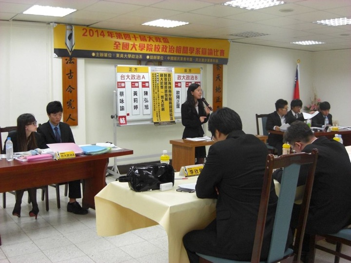
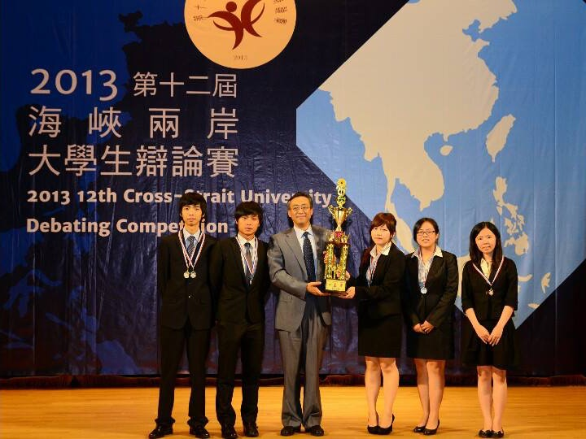
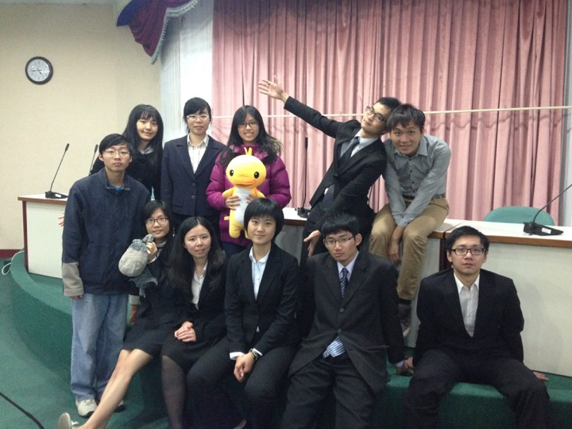

---
---

<link rel="stylesheet" href="styles.css" type="text/css">

## Extracurricular Activities

------

### Experience

* President, Debate club, National Taiwan University (Sep. 2013 – Feb. 2014)
* Chief Executive, The 15th Jing-Ying International Debate Competition for Senior High School Students (Feb. 2014)
* Club Advisor, Debate club, Wesley Girls High School (Feb. 2015 – Jul. 2015)
* Club Advisor, Debate club, Taipei First Girls High School (Sep. 2013 – Aug. 2014)

------

### Award

* Third Prize Winner and Champion Debater, The 1st National Debate Competition of Forest Management (2015) 
第一屆臺灣森林盃辯論比賽季軍暨最佳辯士（2015年）
* Second Prize Winner and Champion Debater, The 40th National Debate Competition for Tertiary Education of Political Science (2014) 
第四十屆全國大專院校政治相關科系辯論比賽亞軍暨最佳辯士（2014年）
* First Prize Winner and Champion Debater, The 7th National Debate Competition of incorruptGovernance (2013) 
第七屆廉政盃大專院校校際辯論比賽冠軍暨最佳辯士（2013年）

------

### Photo

The 40th National Debate Competitionof Political Science (2014)

The 12th Cross-Strait University Debating Competition (2013)

The 15th Jing-Ying International Debate Competition for Senior High School (2014)

