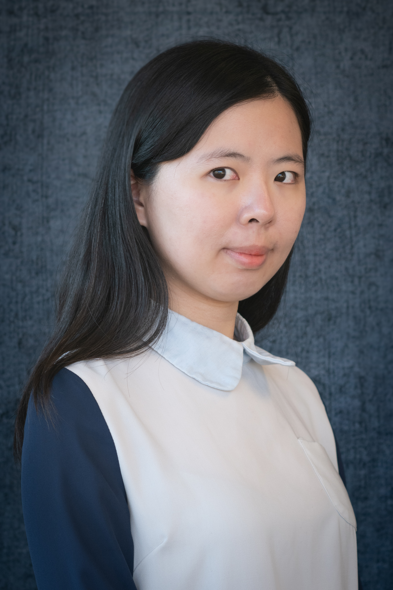

<link rel="stylesheet" href="styles.css" type="text/css">

<!--
<iframe width="560" height="315" style="margin-right: 20px" align="left" frameborder="0"
src="https://www.youtube.com/embed/-26g5lJaFhE">
</iframe>
--> 

I am a doctoral candidate at the University of Missouri <a href = "https://truman.missouri.edu" target="_blank">Harry S Truman School of Government and Public Affairs</a>. 

My research focuses on public finance and social equity, particularly focusing on the policy area of education and taxation policy. Her research seeks to understand how government spending (through direct funding or indirect tax benefits) or education programs may affect equity in access to resources, opportunity, or well-being and labor market outcomes.

I obtained my MPA (Master in Public Administration) degree from National Chengchi University (Taiwan) in 2019 and a Bachelor of Arts in Political Science from National Taiwan University in 2015. Prior to starting my graduate degree, I worked in the Congress of Taiwan.

My full CV is available <a href = "files/CV_YungYuTsai.pdf" target="_blank">here</a>

Contact: ytsai@mail.missouri.edu