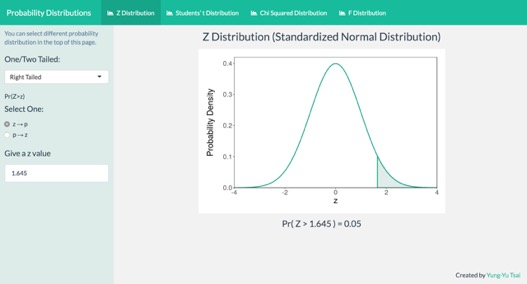
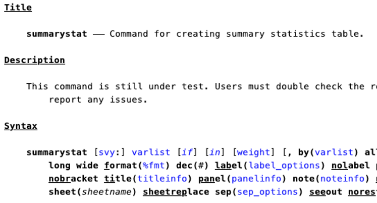

---
---

<link rel="stylesheet" href="styles.css" type="text/css">

## Projects

------

### R Projects

<a href = "https://yungyutsai.shinyapps.io/probability_distributions/" target="_blank">
Probability Distribution Calculator
</a>

------

### Stata Projects

<a href = "https://github.com/yungyutsai/summarystat" target="_blank">
A Summary Statistics Program
</a> _(Under Test)_

